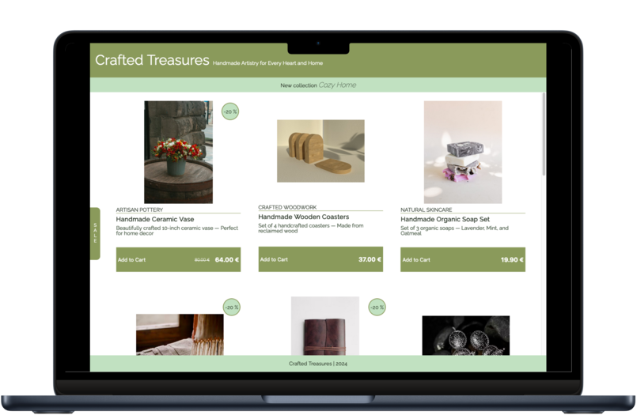

# Crafted Treasures

## Handmade Artistry for Every Heart and Home

Crafted Treasures is an online (fictional) boutique offering a curated collection of artisanal products and creations, designed to add a touch of craftsmanship to their customers life. From handcrafted ceramics to eco-friendly textiles, each piece is lovingly made by skilled artisans to bring beauty and joy to your home.

This project (my very first project ever!) showcases a simple yet elegant interface for an online store, created using pure HTML and CSS.

## Project Overview

This project consists of HTML and CSS files that together create the front end of an e-commerce website. The website features a collection of handcrafted items, each presented in a card layout with an image, description, and pricing information. Users can easily browse through the items and add them to their cart with the click of a button.

## Features

- Clean and minimalist design
- Responsive layout for seamless viewing on various devices
- Sale tags for discounted items
- Easy navigation with category names for each product
- Add to cart functionality for a smooth shopping experience

## Technologies Used

- HTML: Provides the structure and content of the web pages.
- CSS: Styles the HTML elements to enhance visual appeal and layout.

## Usage

To view the project, simply open the HTML files in a web browser. You can navigate through the different product cards and explore the features of the online store interface.
